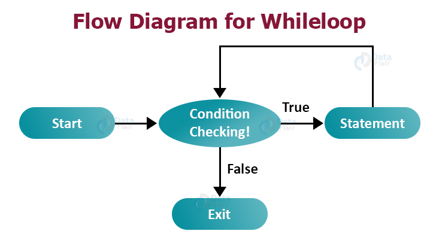

| Flex: Week 2 Day 2 |
| ------------------ |

Loop menawarkan cara cepat dan mudah untuk **melakukan sesuatu secara berulang-ulang.**
Iterasi merupakan sifat tertentu dari algoritma atau program dimana suatu urutan atau lebih langkah algoritmik dilakukan di **loop** program.
Jadi disini **Loop (repeat steps)** memiliki **variabel iterasi** yang berubah setiap kali melalui loop.

Di Javascript yang akan kita pelajari ada 2 dulu yaitu:

- for loop
- while loop
- do while (explore sendiri)

## For loop

> ❗ Basanya digunakan ketika kita sudah tahu sampai mana berhentinya (batas akhir) iterasinya

### Syntax For Loop

for statement mempunyai 3 expression yang bersifat optional untuk mengimplementasikan loop
yaitu

```js
for ([initialExpression]; [condition]; [incrementExpression]) {
  Statement to Execute;
}
```

proses yang dijalankan yaitu:

<p align="center">
  
</p>

### Contoh For Loop

- contoh Pseudocode:

  ```
  FOR i FROM 0 TO 4 INCREMENT BY 1
    DISPLAY 'Hello'
  END FOR
  ```

  outputnya setelah di implementasikan di javascript:

  ```bash
  Hello
  Hello
  Hello
  Hello
  Hello
  ```

- contoh syntax di javascript:

  ```js highlight={1,3}
  for (var i = 0; i < 10; i++) {
    console.log(i + " Saya tidak akan mengulangi lagi");
  }
  ```

  outputnya ketika dijalankan:

  ```bash
  0 Saya tidak akan mengulangi lagi
  1 Saya tidak akan mengulangi lagi
  2 Saya tidak akan mengulangi lagi
  3 Saya tidak akan mengulangi lagi
  4 Saya tidak akan mengulangi lagi
  5 Saya tidak akan mengulangi lagi
  6 Saya tidak akan mengulangi lagi
  7 Saya tidak akan mengulangi lagi
  8 Saya tidak akan mengulangi lagi
  9 Saya tidak akan mengulangi lagi
  ```

> 🐣 Increment expression dapat dipersingkat dengan namVar`++` yang berarti bertambah 1 ataupun decrement namaVar`--` yang berarti berkurang 1 di setiap loopnya.

> 👌 variabel initialisasi tidak selalu dimulai dari 0, bisa juga dari angka lainnya, misal:

```js
for (var langkah = 210; langkah < 300; langkah++) {
  // statetment to execute
}
```

selain penggunaan `++` atau `--` bisa juga dengan:

```js highlight={1}
for (var langkah = 210; langkah < 300; langkah += 2) {
  // langkah akan bertambah 2 disetiap loop
  // statetment to execute
}
```

## While Loop

> ❗ Biasanya digunakan ketika yang diketahui hanya **berakhirnya kapan** tanpa diketahui berapa kali ada perulangan

### Syntax While Loop

While hanya berjalan ketika condition nya memenuhi sayrat atau berniali true/benar

```js
while (condition) {
  // Statement to Execute
}
```

Proses yang dijalankan yaitu:

<p align="center">
  
</p>

### Contoh While Loop

- contoh Pseudocode:

  ```
  STORE i WITH 0
  WHILE i LESS THAN 5
  DISPLAY 'Hello'
  SET i WITH i PLUS 1
  END WHILE
  ```

  yang keluar di konsole ketika diimplementasikan:

  ```bash
  Hello
  Hello
  Hello
  Hello
  Hello
  ```

- contoh syntax di javascript:

  ```js
  var x = 10;
  while (x !== 0) {
    console.log("hai " + x);
    x -= 2;
  }
  ```

  outputnya di javascript:

  ```bash
  hai 10
  hai 8
  hai 6
  hai 4
  hai 2
  ```

## Infinite Loop & Loop Tidak Berjalan

### Infinite loop

Infinite loop terjadi ketika **kondisi** yang diperiksa **selalu bernilai benar** atau tidak ada titik dimana kondisi tersebut salah sehingga loop akan terus berjalan.

> ❗ Cara menghentikan Infinite loop dapat menggunakan `ctrl+c` di terminal atau dengan kill terminal.

- contoh jika menggunakan `for`:

  ```js highlight={1}
  for (var i = 0; i < 1; i--) {
    // Disini i bernilai 0 dimana kondisinya yaitu ketika i kurang dari 1
    // dan i tersebut di decrement yang berarti berkurang 1 setiap loop
    // seingga i < 1 selalu bernilai benar
    console.log("Hadir");
  }
  ```

  outpunya menjadi:

  ```bash
  Hadir
  Hadir
  Hadir
  ...(terus tidak berhenti)
  ```

- contoh jika menggunakan `while`:

  ```js
  while (true) {
    console.log("Hadir");
  }
  ```

  outpunya menjadi:

  ```bash
  Hadir
  Hadir
  Hadir
  ...(terus tidak berhenti)
  ```

### Loop Tidak Berjalan

Loop tidak bisa berjalan jika **kondisi tidak memenuhi** sama sekali atau **selalu berniali salah**.
contohnya:

```js
for (var i = 10; i < 1; i++) {
  // disini i adalah 10 dan kondisi yang berjalan ketika i kurang dari 1
  // dimana hal tersebut tidak benar karena initialisasinya lebih besar dari 1
  console.log("Hadir");
}
```

## Exploration

Ingatkah kamu dengan string yang mempunyai length / panjang
kamu bisa ases setiap karakter menggunakan loop

```js
let batch = "armenian";
for (var index = 0; index < batch.length; index += 1) {
  console.log(batch[index]);
}
```

maka outpunya yaitu:

```bash
a
r
m
e
n
i
a
n
```

> 🚩 Tambahan kasus, bagaimana jika hanya meampilkan yang huruf a saja?

```js
let batch = "armenian";
for (var index = 0; index < batch.length; index += 1) {
  if (batch[index] === "a") {
    console.log(batch[index]);
  }
}
```

maka outputnya:

```bash
a
a
```
